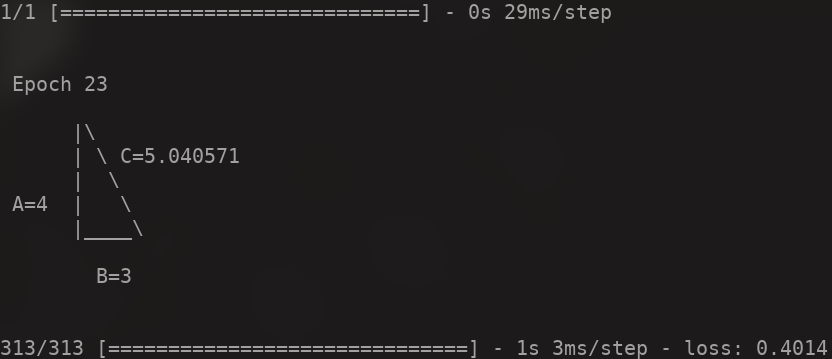

# Neural Network Solving Pitagoras' Theorem

Python code that prints the result of a neural network trying to solve Pythagoras’ theorem in real-time in your terminal.



```
git clone https://github.com/kritserv/neural-network-solve-pitagoras.git
```

```
pip install -r requirements.txt
```

```
py run.py
```
